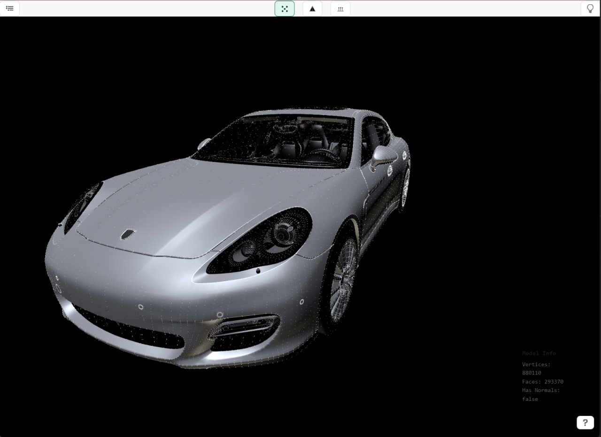

As the default viewer from Windows store is reaching its end of life, 
I decided to create a plugin for chrome that would enable viewing 3D models much like regular .pdf files.

Currently implemented:

- ### Lighting configurations
- ### Background color
- ### Model loading (drop on the index.html supports obj, stl, fbx, glb, gltf)
- ### Model loading (drop on the sidepane.html only supports .obj)
- ### Vertices
- ### Per vertex Normals
- ### Edges

